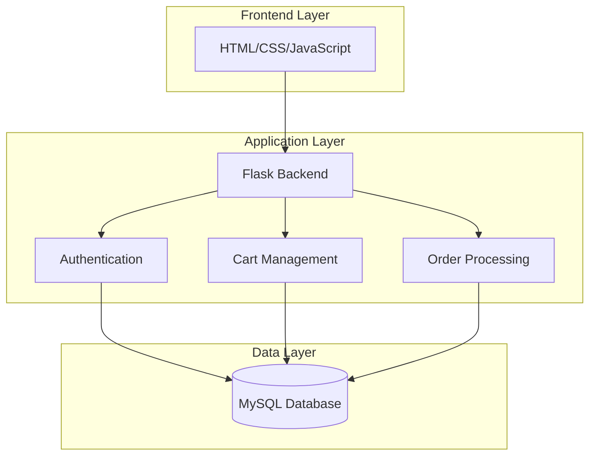
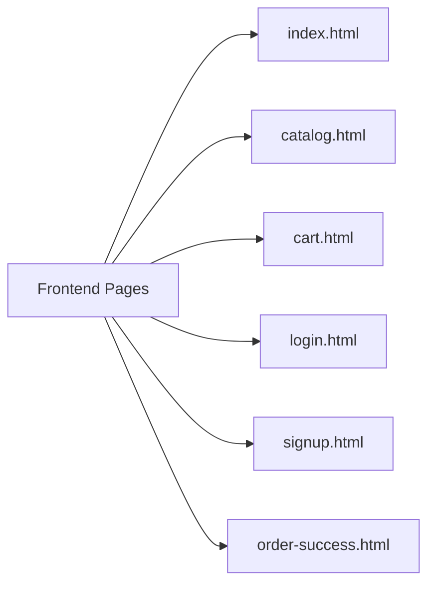
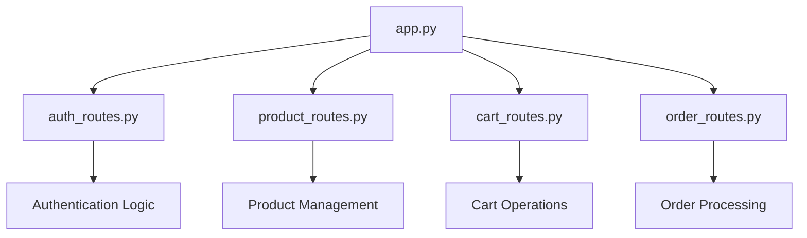
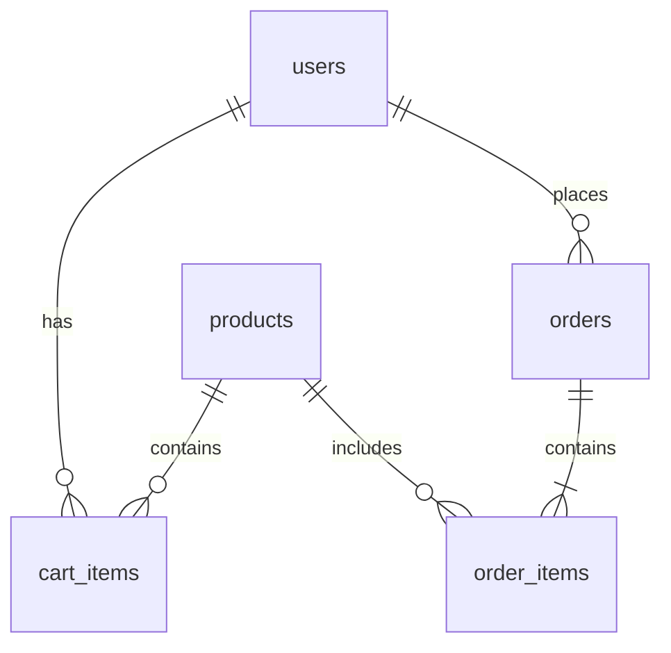
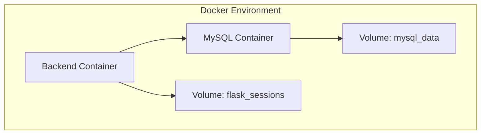

# ShopEasy E-commerce Application
## Complete System Documentation

## Table of Contents
1. [Introduction](#1-introduction)
2. [System Architecture](#2-system-architecture)
3. [Technical Components](#3-technical-components)
4. [Database Design](#4-database-design)
5. [API Documentation](#5-api-documentation)
6. [Setup and Deployment](#6-setup-and-deployment)
7. [Security Features](#7-security-features)
8. [Testing Strategy](#8-testing-strategy)
9. [Troubleshooting Guide](#9-troubleshooting-guide)
10. [Development Guidelines](#10-development-guidelines)
11. [Project Setup and Deployment Guide](#11-project-setup-and-deployment-guide)

## 1. Introduction

### 1.1 Project Overview
ShopEasy is a modern e-commerce application built using a three-tier architecture. It provides essential e-commerce functionalities including user authentication, product browsing, cart management, and order processing.

### 1.2 Key Features
- User Authentication (Login/Signup)
- Product Catalog
- Shopping Cart Management
- Order Processing
- Session Management
- Responsive Design

### 1.3 Technology Stack
- Frontend: HTML5, CSS3, JavaScript
- Backend: Python, Flask Framework
- Database: MySQL 8.0
- Containerization: Docker, Docker Compose

## 2. System Architecture

### 2.1 High-Level Architecture


### 2.2 Component Architecture

#### Frontend Components


#### Backend Components


## 3. Technical Components

### 3.1 Frontend Structure
```
frontend/
├── index.html        # Home page
├── catalog.html      # Product listing
├── cart.html        # Shopping cart
├── login.html       # User login
├── signup.html      # User registration
├── order-success.html # Order confirmation
└── styles.css       # Global styles
```

### 3.2 Backend Structure
```
backend/
├── app.py           # Application entry point
├── routes/          # API route handlers
│   ├── auth_routes.py
│   ├── cart_routes.py
│   ├── order_routes.py
│   └── product_routes.py
├── models/          # Data models
│   ├── user.py
│   ├── product.py
│   └── order.py
├── database/        # Database scripts
│   ├── 01_schema.sql
│   └── 02_data.sql
└── Dockerfile.backend
```

## 4. Database Design

### 4.1 Schema Diagram


### 4.2 Table Structures
```sql
-- Users Table
CREATE TABLE users (
    id INT PRIMARY KEY AUTO_INCREMENT,
    username VARCHAR(255) UNIQUE NOT NULL,
    password_hash VARCHAR(255) NOT NULL,
    created_at TIMESTAMP DEFAULT CURRENT_TIMESTAMP
);

-- Products Table
CREATE TABLE products (
    id INT PRIMARY KEY AUTO_INCREMENT,
    name VARCHAR(255) NOT NULL,
    price DECIMAL(10,2) NOT NULL,
    description TEXT
);

-- Cart Items Table
CREATE TABLE cart_items (
    id INT PRIMARY KEY AUTO_INCREMENT,
    user_id INT NOT NULL,
    product_id INT NOT NULL,
    quantity INT NOT NULL DEFAULT 1,
    FOREIGN KEY (user_id) REFERENCES users(id),
    FOREIGN KEY (product_id) REFERENCES products(id)
);

-- Orders Table
CREATE TABLE orders (
    id INT PRIMARY KEY AUTO_INCREMENT,
    user_id INT NOT NULL,
    total_amount DECIMAL(10,2) NOT NULL,
    created_at TIMESTAMP DEFAULT CURRENT_TIMESTAMP,
    FOREIGN KEY (user_id) REFERENCES users(id)
);

-- Order Items Table
CREATE TABLE order_items (
    id INT PRIMARY KEY AUTO_INCREMENT,
    order_id INT NOT NULL,
    product_id INT NOT NULL,
    quantity INT NOT NULL,
    FOREIGN KEY (order_id) REFERENCES orders(id),
    FOREIGN KEY (product_id) REFERENCES products(id)
);
```

## 5. API Documentation

### 5.1 Authentication Endpoints

#### Login
- **URL**: `/api/auth/login`
- **Method**: `POST`
- **Body**:
```json
{
    "username": "string",
    "password": "string"
}
```
- **Response**:
```json
{
    "message": "Login successful",
    "user": {
        "user_id": "integer",
        "username": "string"
    }
}
```

#### Signup
- **URL**: `/api/auth/signup`
- **Method**: `POST`
- **Body**:
```json
{
    "username": "string",
    "password": "string"
}
```

### 5.2 Product Endpoints

#### Get Products
- **URL**: `/api/products`
- **Method**: `GET`
- **Response**: List of products

### 5.3 Cart Endpoints

#### Get Cart
- **URL**: `/api/cart`
- **Method**: `GET`
- **Response**: Cart items with totals

#### Add to Cart
- **URL**: `/api/cart`
- **Method**: `POST`
- **Body**:
```json
{
    "product_id": "integer",
    "quantity": "integer"
}
```

### 5.4 Order Endpoints

#### Create Order
- **URL**: `/api/orders`
- **Method**: `POST`
- **Body**:
```json
{
    "user_id": "integer",
    "total_amount": "float",
    "items": [
        {
            "product_id": "integer",
            "quantity": "integer"
        }
    ]
}
```

## 6. Setup and Deployment

### 6.1 Prerequisites
- Git
- Docker
- Docker Compose

### 6.2 Installation Steps

1. **Clone Repository**
```bash
git clone https://github.com/kkfundadevops/ShopEasy-E-commerce-Application-kk-funda.git
cd ShopEasy-E-commerce-Application-kk-funda/
```

2. **Environment Setup**
```bash
cp .env.example .env

# Update .env with your configurations:
DB_HOST=db
DB_USER=subbu
DB_PASSWORD=admin@1234
DB_NAME=ecommerce
SECRET_KEY=your_secure_secret_key
FLASK_DEBUG=True
PORT=5000
SESSION_FILE_DIR=/tmp/flask_sessions
```

3. **Docker Deployment**
```bash
# Build and start containers
docker-compose -f docker/docker-compose.yaml up --build

# Run in background
docker-compose -f docker/docker-compose.yaml up --build -d

# View logs
docker-compose -f docker/docker-compose.yaml logs -f
```

### 6.3 Container Structure


## 7. Security Features

### 7.1 Authentication
- Session-based authentication
- Password hashing using secure algorithms
- Session timeout management
- CSRF protection

### 7.2 Data Security
- SQL injection prevention
- XSS protection
- Input validation
- Secure password storage
- CORS configuration

## 8. Testing Strategy

### 8.1 Testing Levels
1. Unit Testing
2. Integration Testing
3. System Testing
4. User Acceptance Testing

### 8.2 Test Coverage
- API endpoints
- Database operations
- Authentication flow
- Business logic
- User interface

## 9. Troubleshooting Guide

### 9.1 Common Issues

#### Database Connection Issues
```bash
# Check database container
docker-compose -f docker/docker-compose.yaml ps db

# View database logs
docker-compose -f docker/docker-compose.yaml logs db
```

#### Session Issues
```bash
# Check session directory
docker-compose -f docker/docker-compose.yaml exec backend ls -la /tmp/flask_sessions

# Clear sessions
docker-compose -f docker/docker-compose.yaml exec backend rm -rf /tmp/flask_sessions/*
```

### 9.2 Debug Commands
```bash
# Backend shell access
docker-compose -f docker/docker-compose.yaml exec backend bash

# Database access
docker-compose -f docker/docker-compose.yaml exec db mysql -u subbu -p
```

## 10. Development Guidelines

### 10.1 Code Structure
- Follow PEP 8 for Python code
- Use proper HTML5 semantic elements
- Maintain consistent CSS naming conventions
- Follow REST API best practices

### 10.2 Git Workflow
1. Create feature branch
2. Make changes
3. Test locally
4. Submit pull request
5. Code review
6. Merge to main

### 10.3 Deployment Process
1. Test in development
2. Build Docker images
3. Deploy to staging
4. Run integration tests
5. Deploy to production

## 11. Project Setup and Deployment Guide

### 11.1 Prerequisites
- Git
- Docker
- Docker Compose
- Make (optional, for Makefile commands)

### 11.2 Project Setup Steps

1. **Clone the Repository**
```bash
# Clone the repository
git clone https://github.com/yourusername/shopeasy.git
cd shopeasy
```

2. **Environment Configuration**
```bash
# Copy example environment file
cp .env.example .env

# Update .env file with your configurations
DB_HOST=db
DB_USER=subbu
DB_PASSWORD=admin@1234
DB_NAME=ecommerce
SECRET_KEY=your_secure_secret_key
FLASK_DEBUG=True
PORT=5000
SESSION_FILE_DIR=/tmp/flask_sessions
```

3. **Project Structure**
```
shopeasy/
├── backend/
│   ├── app.py
│   ├── routes/
│   ├── models/
│   ├── database/
│   └── Dockerfile.backend
├── frontend/
│   ├── index.html
│   ├── catalog.html
│   ├── cart.html
│   └── styles.css
├── docker/
│   └── docker-compose.yaml
├── .env
└── README.md
```

4. **Docker Compose Deployment**
```bash
# Build and start containers
docker-compose -f docker/docker-compose.yaml up --build

# To run in detached mode
docker-compose -f docker/docker-compose.yaml up --build -d

# To stop the containers
docker-compose -f docker/docker-compose.yaml down

# To view logs
docker-compose -f docker/docker-compose.yaml logs -f
```

5. **Database Initialization**
```bash
# Database migrations and initial data will be loaded automatically 
# from the SQL files in backend/database/ directory:
- 01_schema.sql
- 02_data.sql
```

6. **Verify Deployment**
- Access the application: http://localhost:5000
- Check container status:
```bash
docker-compose -f docker/docker-compose.yaml ps
```

7. **Troubleshooting Commands**
```bash
# Check backend logs
docker-compose -f docker/docker-compose.yaml logs -f backend

# Check database logs
docker-compose -f docker/docker-compose.yaml logs -f db

# Restart specific service
docker-compose -f docker/docker-compose.yaml restart backend

# Remove volumes and clean start
docker -compose -f docker/docker-compose.yaml down -v
docker-compose -f docker/docker-compose.yaml up --build
```

### 11.3 Initial Data and Testing
1. Default test account:
   - Username: subbu
   - Password: admin@1234

2. Test the deployment:
   - Visit http://localhost:5000
   - Login with test credentials
   - Browse catalog
   - Add items to cart
   - Place test order

### 11.4 Common Issues and Solutions

1. **Database Connection Issues**
```bash
# Check if database is running
docker compose -f docker/docker-compose.yaml ps db

# Check database logs
docker compose -f docker/docker-compose.yaml logs db

# Manual database connection test
docker compose -f docker/docker-compose.yaml exec db mysql -u subbu -p
```

2. **Session Issues**
```bash
# Check session directory permissions
docker compose -f docker/docker-compose.yaml exec backend ls -la /tmp/flask_sessions

# Clear sessions
docker compose -f docker/docker-compose.yaml exec backend rm -rf /tmp/flask_sessions/*
```

3. **Port Conflicts**
```bash
# Check if ports are in use
netstat -tulpn | grep 5000
netstat -tulpn | grep 3306

# Change ports in docker-compose.yaml if needed
```

### 11.5 Development Commands

1. **Access Container Shell**
```bash
# Backend container
docker compose -f docker/docker-compose.yaml exec backend bash

# Database container
docker compose -f docker/docker-compose.yaml exec db bash
```

2. **Database Management**
```bash
# Create database backup
docker compose -f docker/docker-compose.yaml exec db mysqldump -u subbu -p ecommerce > backup.sql

# Restore database
docker compose -f docker/docker-compose.yaml exec -T db mysql -u subbu -p ecommerce < backup.sql
```

3. **Code Updates**
```bash
# Apply code changes
docker compose -f docker/docker-compose.yaml restart backend

# View updated logs
docker compose -f docker/docker-compose.yaml logs -f backend
```

### 11.6 Production Deployment Notes

1. **Security Considerations**
- Update SECRET_KEY in .env
- Set FLASK_DEBUG=False
- Use proper SSL/TLS certificates
- Update database passwords
- Remove test accounts

2. **Performance Optimization**
- Configure proper database indexes
- Set up proper logging
- Configure backup strategy
- Set up monitoring

3. **Scaling Notes**
- Configure load balancer if needed
- Set up database replication
- Configure proper cache strategy
- Set up proper monitoring and alerts

